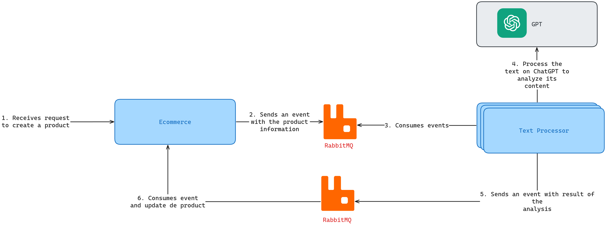

# ADR 003: Product description validation using AI
## Problem
When a user creates a product, the system must ensure that the description is valid, so that 
inadequate or harmful descriptions are discarded and the product announcement is cancelled.

In order to cope with high volumes of products, the analysis should be done asynchronously and automatically, 
reducing the number of manual interventions.

## Decision
The description will be analysed by Chat GPT-4. A second system will be created to process the description in background. This component
will process events delivered by a RabbitMQ instance. The architecture should be similar to the image below: 

### Components
- **Ecommerce web server:** The current backend implementing the necessary logic to create products, and trigger events as new products are registered;
- **RabbitMQ:** The message broker responsible for delivering events to the appropriate consumers;
- **Text Processor:** The service responsible for communicating with Chat GPT-4. This service emits events with the analysis's result;
- **Chat GPT-4:** The service responsible for analysing the text.

## Consequences
This is an interesting solution for analyzing texts using Artificial Intelligence (AI). Its asynchronous nature promotes scalability, resilience, and performance.

Even though most analyses will yield good results, false positives are still possible. Therefore, the system must provide a mechanism to validate those outcomes: human interaction is not 
discarded at all.

Also, the server must ensure that the events produced are atomic, i.e., the events are guaranteed to be published as soon as the transaction commits. For that matter, the _Outbox Pattern_ might be the best option.

Another challenge lies in duplicate events being redelivered to both Ecommerce and Text Processor components. 
To mitigate the side effects of duplicate processing of events, the service logic must be idempotent, either naturally or via a processed events table.

