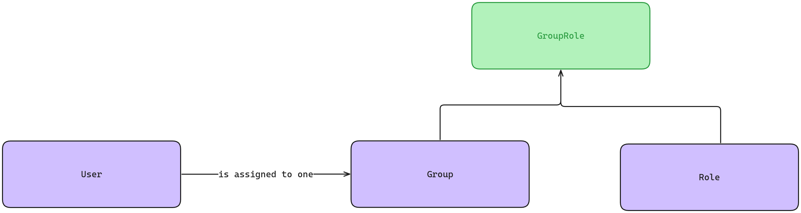

# Story 3: Role-based access control (RBAC)
As a logged-in user, I want to be able to access resources based on my group permissions.

## Functional Requirements

### FR 01: Group
Users must be assigned to groups. A group must contain a collection of roles. A group is composed of the following
properties:
- Group name: Represents the name of the group.
  - **Required:** true;
  - **Pattern:** Alphanumeric characters and special symbols: "-", "/";
  - **Length:** 120.
- Group acronym: Represents the acronym of the group.
  - **Required:** Yes;
  - **Pattern:** Alphanumeric characters;
  - **Length:** 150;
  - **Unique:** Yes.
- Creation date: Represents the time when the group was created.
  - **Required:** Yes;
  - **Pattern:** Timestamp.

### FR 02: Role
Each group is composed of one or more roles. Different groups may have common roles assigned to them.

A role contains the properties listed below:
- Role description: With the characteristics of the role
  - **Required:** Yes;
  - **Length:** 500.
- Role acronym: Represents the acronym of the role
  - **Required:** Yes;
  - **Length:** 100;
  - **Unique:** Yes.

## FR 03: Groups and Roles
The system must already provide the following groups and roles:

| Group Name | Roles                                                                           |
|------------|---------------------------------------------------------------------------------|
| ADMIN      | CREATE_ADMIN, DELETE_ACCOUNT, DELETE_PRODUCT, DELETE_REVIEW, CREATE_CATEGORY    |
| CONSUMER   | CREATE_PRODUCT, BUY_PRODUCT, CREATE_CATEGORY, REVIEW_PRODUCT, DELETE_REVIEW     |

## Non Functional Requirements
### NFR 01: Insertions
At first, the groups, roles, and their relationship must be inserted manually, via database migrations. 
At the proper time, the system must provide an endpoint to create groups and roles.

### NFR 02: Relationship
Using a relational database, the users, groups and roles must interact with each other as shown in the diagram below:
