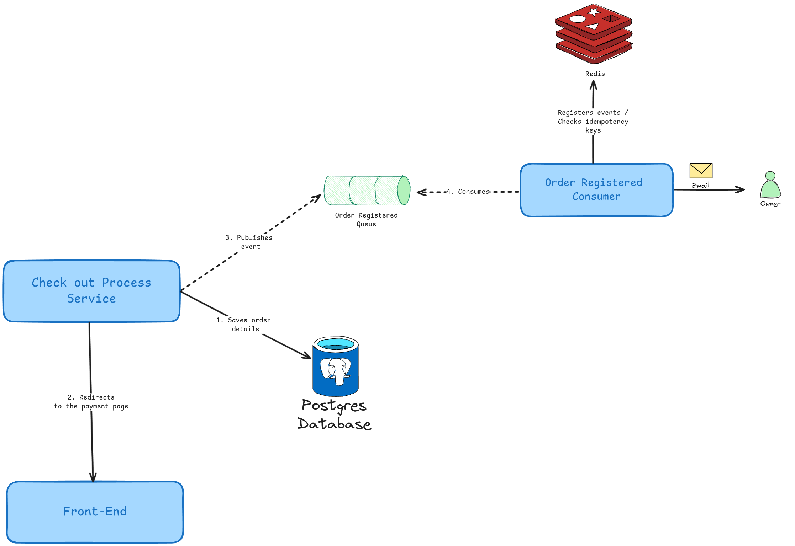

# History

As a customer

I want to buy a product with PayPal or PagSeguro

So that I can use my preferred and trusted payment method during checkout.

# Functional Requirements

The system must allow customers to check out via PayPal or PagSeguro. After checking out, the customer is redirected to the “Last Purchases” page.

## FR 01 - Checkout

When a customer selects a product, the system must show two buttons for payment: “Pay with PayPal” or “Pay with PagSeguro”. Upon clicking the desired provider, the system must redirect the user to the appropriate payment page. After the payment process (whether successful or failed), the customer is redirected back to the order details page.

### Acceptance Criteria

1. Product stock is reduced based on the quantity purchased;
2. An order is persisted with the following information:
    1. ID of the Order;
    2. Buyer (customer);
    3. Creation date;
    4. Selected Gateway;
    5. Selected Product;
    6. Quantity;
    7. Product’s price.
3. The order is saved with the status “PAYMENT PENDING”;
4. An email notification is sent to the product owner with the order details.
5. The customer is redirected to the gateway payment page;
6. If there is an error, the system must show a detailed message about the problem;
7. If there is insufficient stock, the order is canceled and the customer is informed.

### Restrictions

- The quantity is required and must be greater than 0;
- The quantity must not be greater than the available stock;
- The product’s stock must be available;
- The user must be logged to buy a product;
- Owners can not buy their own products.

# Quality requirements

## Security

### Requests

All requests must be sent with a valid JWT token. Requests with an expired token or without it must be rejected with appropriate status code, `401 Unauthorized`.

If the user does not have permission to perform the action, the server must return the `403 Forbidden` status code.

### Order ID exposure

For each order, the system must generate two IDs: an ID generated by a database sequence and a UUID. The former must be only used in the server, without exposing it to external clients. Whereas the latter can be exposed publicly, e.g., the redirect URI.

## Performance

In normal conditions, the request latency must not be longer than 600ms.

## Scalability

The flow must be designed to support horizontal scalability. With the proper level of concurrency, the system can ensure data consistency while providing good performance during high-traffic scenarios.

## NFR 03 - Architecture

The architecture to implement this workflow is shown in Figure 1. As soon as the order is saved, the backend publishes an event to a RabbitMQ topic. A consumer is set to read messages from this topic and notify the product owner about the purchase.

The Redis server is used to store idempotency keys to avoid duplicate messaging processing, thus mitigating the risk of sending duplicate emails to users.

