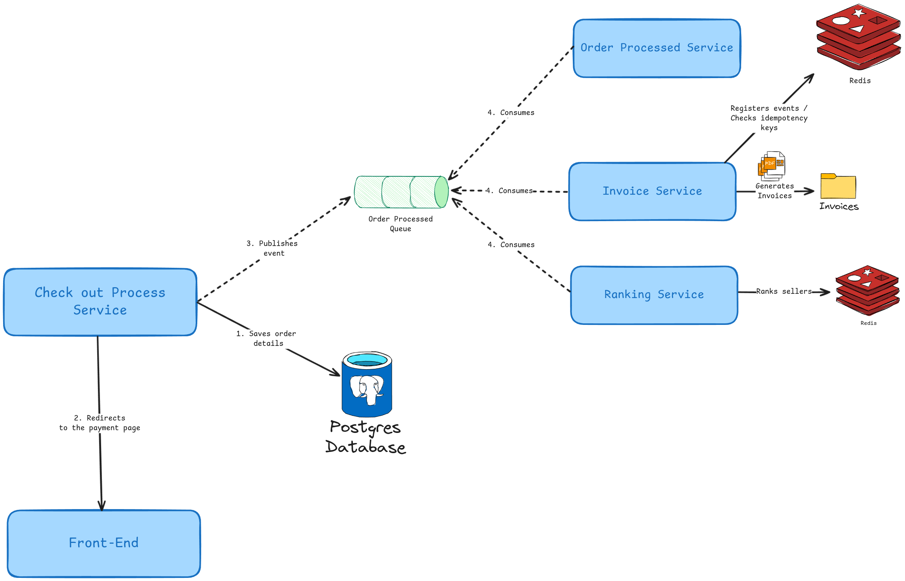

# History

**As a** customer,

**I want** my order to be processed by the system after checkout,

**So that** I can receive the product I’ve purchased.

# Functional Requirements

The payment gateway **must return the payment status** (e.g., successful or failed) **immediately after** the customer completes the purchase process.

## FR 01 - Order processing

The information sent to the **Order Service** depends on the selected gateway:

- If **PayPal** is selected, it must provide the following data:
    - Order ID;
    - Transaction ID;
    - Payment Status:
        - `0` for Error
        - `1` for Success.
- If **PagSeguro** is selected, it must provide the following data:
    - Order ID;
    - Transaction ID;
    - Payment Status:
        - `"ERROR"` or `"SUCCESS"`.

### Acceptance Criteria

1. The **order’s status is updated** based on the payment result.
2. If the order is processed successfully:
    - The order status is set to **"PROCESSED"**;
    - The system records the **timestamp** of when the order was processed;
    - The system notifies the **Invoice Service** to generate the invoice;
    - The system ranks the seller in the **Ranking Service**;
    - The system notifies the **customer** about the successful processing.
3. If the order fails to process:
    - The system notifies the **customer** about the failure;
    - The system provides a **link or option to retry** the payment or checkout;
    - The system records the **timestamp** of when the failure occurred.

### Restrictions

- A successful order must be processed exactly once;
- An order with status “PROCESSED” must not have its status changed under any circumstances;
- An order with status “ERROR” must not be processed more than 5 times;
- The external **Transaction ID** must be unique across all orders.

# Quality requirements

## NFR 01 - Security

### Requests

All requests must be sent with a valid JWT token. Requests with an expired token or without it must be rejected with appropriate status code, `401 Unauthorized`.

If the user does not have permission to perform the action, the server must return the `403 Forbidden` status code.

### Order ID exposure

For this flow, the system must only use the UUID version of the order’s ID.

### Performance

In normal conditions, the request latency must not be longer than 600ms.

## NFR 02 - Scalability

The flow must be designed to support horizontal scalability. With the proper level of concurrency, the system can ensure data consistency while providing good performance during high-traffic scenarios.

## NFR 03 - Architecture

The architecture to implement this workflow is illustrated in Figure 1. As soon as the order is saved, the backend publishes an event to a RabbitMQ topic.

A **Redis** instance is used to store **idempotency keys**, ensuring events are not processed multiple times. This prevents redundant actions such as invoice generation, seller ranking, or customer notifications.

### Consumers

As long as the order is successfully processed, the other steps can be executed in parallel by the following services:

- **Order Processed Service:** Responsible for notifying customers that their orders have succeeded;
- **Invoice Service:** Generates the order's invoice and saves it as .txt;
- **Ranking Service:** Ranks the sellers.

## NFR 04 - Idempotency

To prevent duplicate processing, the system must enforce idempotency using at least one of the following strategies:

- Using a Redis instance to store the event ID when the flow is not idempotent by nature;
- Using database constraints to avoid duplicate rows.